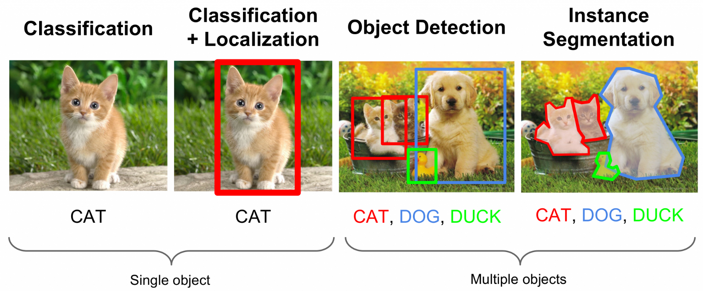
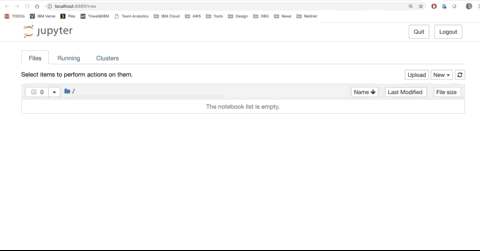

# Deploy, and Consume a Deep Learning Model

Ever wonder how AI is infused into applications, or how custom built AI can be deployed and consumed offline on the edge of a network or in the Cloud? The following example showcases just how to accomplish this task. 

We will create and deploy two different applications in docker containers. The first container will contain a deep learning model, wrapped by a Python Flask Web app exposing a REST API to make predictions using the deep learning model. The second container will host a React web application that utilizes the API hosted by the first container to create a web based photo manipulation tool backed by deep learning. The complete application will not call any external services, and can be run offline on the edges of a network.

## Use-case
Build an application that can run offline or in the cloud, utilizing a deep learning model to provide insights. We want to simplify the task of extracting objects from images utilizing _[image segmentation](https://en.wikipedia.org/wiki/Image_segmentation)_.


## Prerequisites
* `docker`: The [Docker](https://www.docker.com/) command-line iterface. Follow the [installations instructions](https://docs.docker.com/install/) for your system. or use [PlayWithDocker](https://labs.play-with-docker.com/) online
* [IBM Cloud Account](https://cloud.ibm.com)
* *(Optional)* [Promo Code for Free Kubernetes Clusters](https://ibm.biz/promo-code)
* *(Optional)* IBM Cloud CLI [Installation Instructions](https://console.bluemix.net/docs/cli/reference/ibmcloud/cli_docker.html#using-ibm-cloud-developer-tools-from-a-docker-container)
* *(Optional)* IBM Cloud Kubernetes Service [Installation Instructions](https://cdeploymentloud.ibm.com/containers-kubernetes/catalog/cluster)

## Steps
1. [Deploy the Image Segmentation Model Web Application and API to IBM's Kubernetes Service](#1-deploy-the-image-segmentation-model-api-to-ibms-kubernetes-service)
2. [Finding or building the right deep learning model](#2-finding-or-building-the-right-deep-learning-model)
3. [Looking closely at the code](#3-looking-closely-at-the-code)
4. [Consuming the Image Segmentation API](#4-consuming-the-image-segmentation-api)
5. [Start up the Image Segmentation Web Application](#5-start-up-the-image-segmentation-web-application)

### 1. Deploy the Image Segmentation Model API to IBM's Kubernetes Service

Clone this GitHub repository [https://github.com/justinmccoy/max-meetup](https://github.com/justinmccoy/max-meetup) provides instructions yaml file for deploying the deep learning model as a REST API and web application on IBM's Kubernetes Service. 
```sh
git clone https://github.com/justinmccoy/max-meetup
cd max-meetup
```


** **Note you need a working [ibmcloud cli](https://console.bluemix.net/docs/cli/reference/ibmcloud/cli_docker.html#using-ibm-cloud-developer-tools-from-a-docker-container), and a [Kubernetes Cluster](https://cloud.ibm.com/containers-kubernetes/catalog/cluster) created**


### [Create a new Kubernetes Cluster in US South Region](https://cloud.ibm.com/containers-kubernetes/catalog/cluster)

Spin up the IBM CLI Development Docker Container:
```sh
# -v option below is mounting current directory to /workspace on container
docker run -ti -v ./:/workspace ibmcom/ibm-cloud-developer-tools-amd64
```

Login into IBM Cloud account
```sh
# use --sso if logging onto account with Federated ID
ibmcloud login
```

Setup to use the IBM South Region (Free Cluster Access):

```sh
ibmcloud ks region-set us-south
```

Download and export the kubectl configuration for interacting with your newly created cluster:

```sh
ibmcloud ks cluster-config YOUR_CLUSTER_NAME
```

List details about Kubernetes cluster, note the external IP address

```sh
ibmcloud ks workers --cluster YOUR_CLUSTER_NAME
```

Create a new deployment of the MAX-Image-Segmentation REST API

```sh
kubectl create -f max-image-segmenter.yaml
```

Show Kubernetes Deployments on cluster:

```sh
kubectl get deployments
```

Show Kubernetes Services on cluster

```sh
kubectl get services -o wide
```

Show details about Kubernetes service and deployment
```sh
kubectl describe deployment max-image-segmenter
kubectl describe service max-image-segmenter
```

At this point you've deployed your the deep learning model's REST API and a React Web App to Kubernetes, and exposed it to the internet through the defined NodePorts of 30050 30030.  You can now reach the API at the external IP address noted above, at port 30050, or the web application at the external IP address at port 30030.

For example my Web App is deployed to http://184.172.250.9:30030


### 2. Finding or building the right deep learning model
Before we can enable an application with insights from a machine learning model we first must figure out what we want to accomplish, find a model, or build one for ourselves. 

There are several different common usecases, including Image Classification, Image Segmentation, Object Detection, Generative Models, etc.


  
Building a new machine learning model or deep learning model is a big undertaking, one that requires some specialized expertise and a lot of data, before going down that road there are several places to look for pre trained models.  IBM has been working to train and release deep learning and machine learning models across several usage domains available in the [MAX Model Exchange](https://developer.ibm.com/exchanges/models/).  


[Image Segmentation Model](https://developer.ibm.com/exchanges/models/all/max-image-segmenter/)

**Clone the models GitHub repo**
```sh
git clone https://github.com/IBM/MAX-Image-Segmenter
cd MAX-Image-Segmenter
```

This Image Segmenation model has been trained on 20 different objects.

The segmentation map returns an integer between 0 and 20 that corresponds to one of the labels below for each pixel in the input image. The first nested array corresponds to the top row of pixels in the image and the first element in that array corresponds to the pixel at the top left hand corner of the image. NOTE: the image will be resized and the segmentation map refers to pixels in the resized image, not the original input image.

| Id | Label       | Id | Label       | Id | Label       |
|----|-------------|----|-------------|----|-------------|
| 0  | background  | 7  | car         | 14 | motorbike   |
| 1  | aeroplane   | 8  | cat         | 15 | person      |
| 2  | bicycle     | 9  | chair       | 16 | pottedplant |
| 3  | bird        | 10 | cow         | 17 | sheep       |
| 4  | boat        | 11 | diningtable | 18 | sofa        |
| 5  | bottle      | 12 | dog         | 19 | train       |
| 6  | bus         | 13 | horse       | 20 | tv          |


To learn how to build you own models see the following code patterns: 

* [Train a Deep Learning Object Classifier with Keras](https://github.com/IBM/keras-binary-classifier) 
* [Train and evaluate an audio classifier](https://developer.ibm.com/patterns/train-and-evaluate-an-audio-classifier-using-keras-and-jupyter-notebook/)


### Looking closely at the code

Clone the following GitHub Repo:
[https://github.com/IBM/MAX-Image-Segmenter](https://github.com/IBM/MAX-Image-Segmenter)

`git clone https://github.com/IBM/MAX-Image-Segmenter`


Great, we've found a model, and when using a model from MAX it's already packaged and fronted with an Flask app providing an API interface to the trained machine learning model, let's take a closer look at what's happening to host and front a deep learning image model as an API.

Our implementation is using Python Flask to front the deep learning model as a REST API, defining the endpoints and hosting the application as a web service.  Bundled within the Python web service and /predict API is an application that loads the trained deep learning image segmentation model using Tensorflow for Python, and wraps the model with some helper methods to simplify prediction when called from our Flask application.

Flask Web Service exposing two HTTP endpoints

POST /model/predict
GET /model/metadata

Calling POST on the /model/predict endpoint creates a new instance of the `ModelWrapper` class where the deep learning image segmentation model is loaded for inference. Calling predict endpoint with an image returns a mapping of pixel segments where an object has been detected, along with the resized version of the image.  

Let's dig into the code a bit:

* How is the container built?
* What application is started when loading the container?
* What's happening when the /predict URI is invoked
* Where is the deep learning model coming from?
* How is the model being loaded?
* How do you call the model?


### Consuming the Image Segmentation API

Using the Juypter Notebook container we can quickly setup an environment to test the API 

Run the following [docker container](https://github.com/Paperspace/jupyter-docker-stacks/tree/master/tensorflow-notebook) with a Juypter Notebook and Python libraries installed: 
```sh
docker run -it --rm -p 8888:8888 jupyter/tensorflow-notebook
```

One up and running go to the url return from the command above, and import the `docs/selfie.jpg` and the `demo.ipynb` notebook.


Run the `demo.ipynb` notebook to test the deployed deep learning REST API.


### Start up the Image Segmentation Web Application
The [MAX-Image-Segmentation Code Pattern](https://developer.ibm.com/patterns/max-image-segmenter-magic-cropping-tool-web-app/) has a prebuilt React Web Application that utilizes the API to extract out object identified by the image segmentation deep learning model.  

The details and code for this web application are available on [GitHub](https://github.com/IBM/MAX-Image-Segmenter-Web-App) but we need to configure it differently to connect to the REST API deployed on the IBM Cloud Kubernetes Cluster

**Connect to deployed Deep Learning Model REST API**
```sh
docker run -it -e REACT_APP_DEPLOY_TYPE='KUBE' -e REACT_APP_KUBE_IP="<IP_ADDRESS_OF_YOUR_KUBERNETES_CLUSTER>" -e REACT_APP_KUBE_MODEL_PORT='30050' -p 3000:3000 codait/max-image-segmenter-web-app
```

Open up your browser and go to http://localhost:3000


## License

| Component | License | Link  |
| ------------- | --------  | -------- |
| This repository | [Apache 2.0](https://www.apache.org/licenses/LICENSE-2.0) | [LICENSE](LICENSE) |


## Additional Resources
* [Call For Code 2019](docs/Callforcode2019.pptx)
* [IBM Cloud](http://ibm.biz/cloudtaipei)
* [Request IBM Cloud Promo Code](https://ibm.biz/promo-code)
* [MAX Model Exchange](https://developer.ibm.com/exchanges/models/)
* [Cloud Kubernetes Service](https://cloud.ibm.com/containers-kubernetes/catalog/cluster)
* [Free code on IBM Developer](https://developer.ibm.com)
* [Dockerhub](https://hub.docker.com/)
